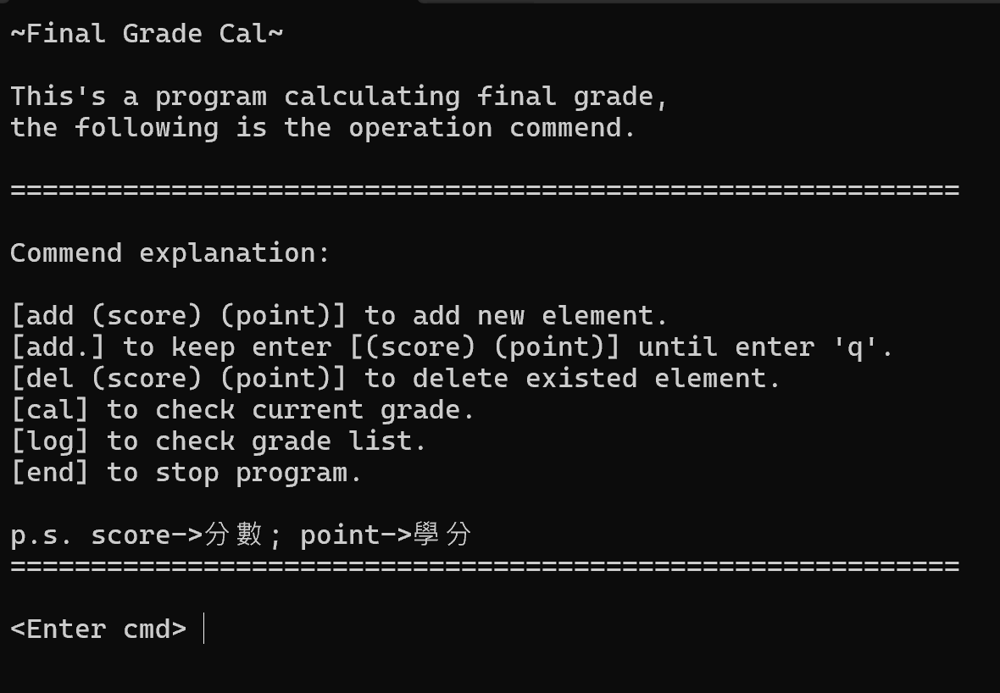

# Final Grade Cal
A program to calculate final grade.

## Initial Screen

## Commend explanation
- [add (score) (point)] to add new element.
- [add.] to keep enter [(score) (point)] until enter 'q'.
- [del (score) (point)] to delete existed element.
- [status] to check current grade.
- [look] to check grade list.
- [end] to stop program.

p.s. score->分數; point->學分