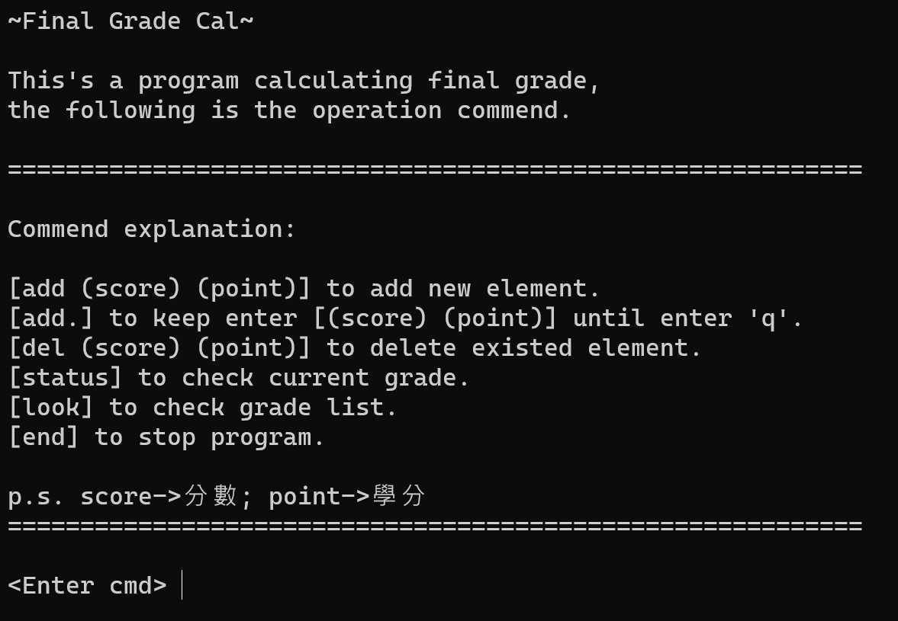

# Final Grade Cal

The project to calculate final grade of a semester.

## Initial Screen

  

## Commend explanation

score：分數／point：學分

- `add (score) (point)` to add new element.
- `add.` to keep enter `(score) (point)` until enter `q`.
- `del (score) (point)` to delete existed element.
- `status` to check current grade.
- `look` to check grade list.
- `end` to stop program.